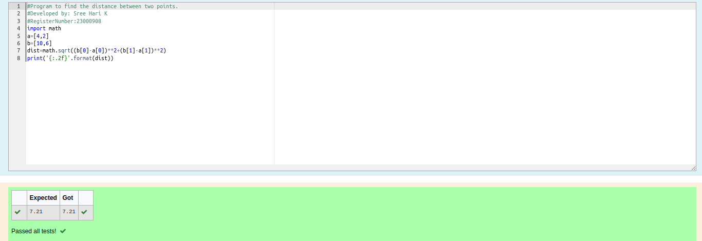

# DISTANCE-BETWEEN-TWO-POINTS

## AIM:
To write a python program to find the distance two 2 points
## ALGORITHM:
### Step 1: 
Import the math module
### Step 2: 
Assign the values to the variables.
### Step 3: 
Substitute the values in the distance formula  
### Step 4: 
Print the distance.
### Step 5: 
End the Program.
### PROGRAM:
```python
#Program to find the distance between two points.
#Developed by: Sree Hari K
#RegisterNumber:23000908
import math
a=[4,2]
b=[10,6]
dist=math.sqrt((b[0]-a[0])**2+(b[1]-a[1])**2)
print('{:.2f}'.format(dist))
  ```


### OUTPUT:


### RESULT:
Thus the program to find the distance between two points is written and verified using python
programming.
